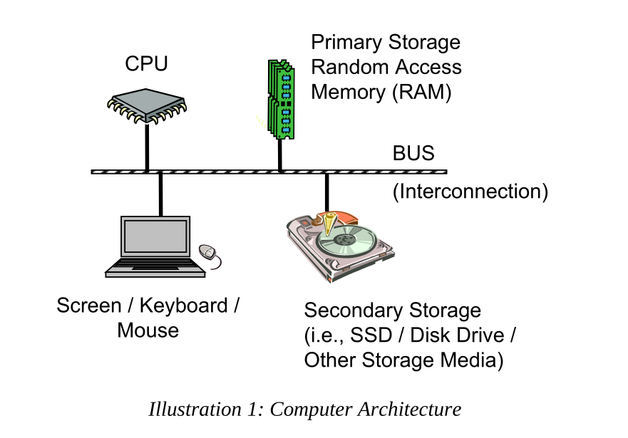
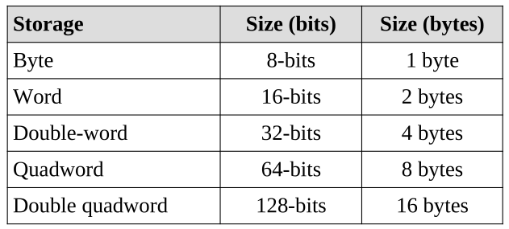
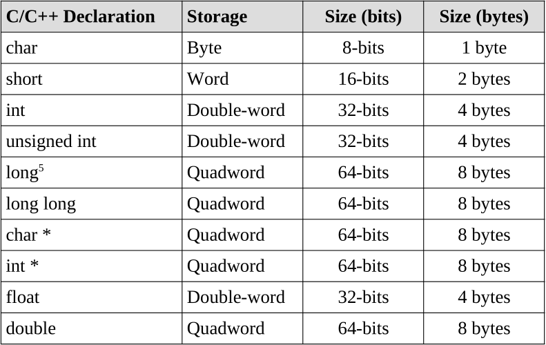
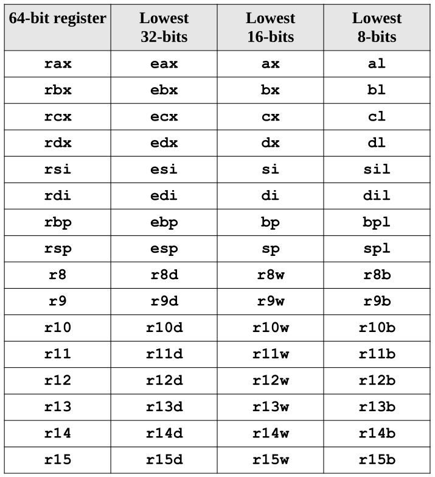
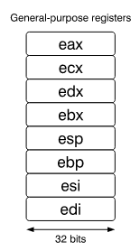

[Back to main Page](../README.md)

[ASCII Table](http://www.asciitable.com/)

# Introduction
The book I use to study shellcode is based on 32 bit systems which is pretty old. So I stumbled across this [book](http://www.egr.unlv.edu/~ed/assembly64.pdf), which explains assembly programming in detail for 64 Bit systems. I have pulled images and text from the book as part of my notes.

# Computer Architecture

# Data Sizes
The x86-64 architecture supports a specific set of data storage size elements, all based on powers of two. The supported storage sizes are as follows:  

  

The below mapping is for C++ data types:  
  

# CPU
## General Purpose CPU Registers
### 64-Bit
 
### 32-Bit
 

# Main Memory
Memory can be viewed as a series of bytes, one after another. That is, memory is byte
addressable. This means each memory address holds one byte of information. To store
a double-word, four bytes are required which use four memory addresses.
Additionally, architecture is little-endian. This means that the Least Significant Byte
(LSB) is stored in the lowest memory address. The Most Significant Byte (MSB) is
stored in the highest memory location.

# Data Represenation
